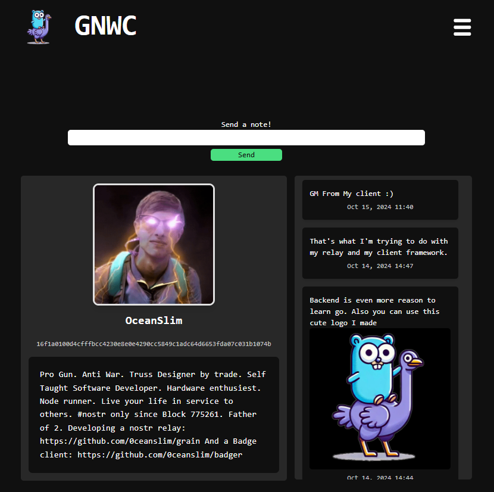

# link 🏗️

## Go Framework for Nostr Web Clients

A lightweight, extensible micro-framework for building Nostr clients using Go. This framework allows users to interact with the Nostr protocol, send notes and view profiles and relays. It’s designed for developers with experience in Go and web development, offering a foundation that’s easy to customize and expand.



## Features

- Send Kind 1 Notes: Send Nostr Kind 1 notes easily using the built-in form.
- View Latest Notes: Displays the user’s latest notes, fetched from connected relays in real-time.
- Profile Viewing: View user profile information such as display name, picture, and a brief description.
- Relay Viewing: Displays a list of user relays categorized as read, write, or both.
- Built-In Themes: Comes with 5 pre-configured themes for easy UI customization.
- Login with NIP-07 or Nsec Bunker: Supports authentication through NIP-07 browser extension or Nsec Bunker.
- Dynamic Updates with HTMX and Hyperscript: Uses HTMX for dynamic page updates and Hyperscript for client-side interactions, offering a smooth user experience without full page reloads.

## Tech Stack

- Backend: Go (Golang)
- Frontend: HTML templates with Tailwind CSS for styling.
- HTMX: For dynamic updates of page sections, such as refreshing notes after a new one is sent.
- Hyperscript: Enhances client-side interactions with minimal JavaScript for handling user actions.  
  it

## Running

- Copy the example config `cp config.example.json config.json` (this just defines the port to run on)

- Then just run `go run ./` from the root directory if you have go on your system or download a pre-compiled binary from the [releases](https://github.com/0ceanSlim/link/releases) page.

## Development

To contribute to link, follow these steps:

1. Fork the repository.
2. Make your changes.
3. Commit your changes:

   ```sh
   git commit -m "Description of changes"
   ```

4. Push to the repo:

   ```sh
   git push
   ```

5. Create a Pull Request.

### License

This project is Open Source and licensed under the MIT License. See the [LICENSE](license) file for details.

### Acknowledgments

Thanks to the Nostr community for providing a decentralized protocol for social interactions.  
Inspired by lightweight micro-frameworks and the flexibility of Go.  
Uses HTMX and Hyperscript for dynamic, interactive front-end behavior.  
Open Source and made with 💦 by [OceanSlim](https://njump.me/npub1zmc6qyqdfnllhnzzxr5wpepfpnzcf8q6m3jdveflmgruqvd3qa9sjv7f60)
